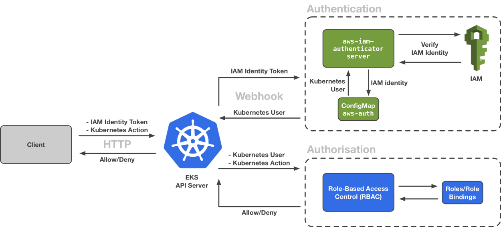
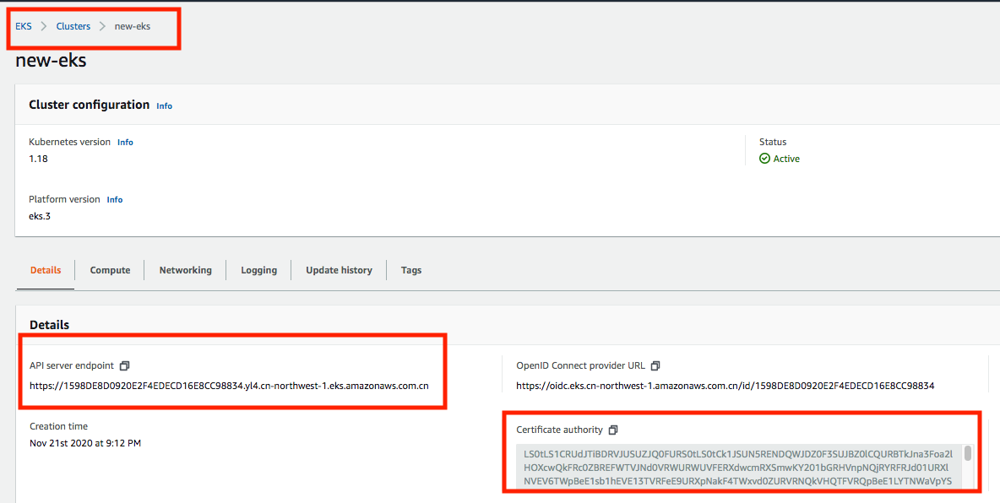

# How to auth with EKS API server

### Prerequsite

* EKS cluster version >= 1.16
* kubectl installed
* jq installed

### Step by Step introducion

#### Auth Flow

EKS support  both [Webhook Token and ServiceAccount token authorization](https://kubernetes.io/zh/docs/reference/access-authn-authz/authentication/), this repo is focused on **Webhook token flow**. Here is the diagram



#### Find CA and Server Address

You could found CA in both EKS console and kubeconfig file. 

* From Console 



* From kubeconfig file

If you create cluster via **eksctl,then you can skip this step** since it will be create  automatically.

```
$ aws eks --region <region-code> update-kubeconfig --name <cluster_name>
```

Get CA and cluster endpoint

```
$ kubectl config view --minify -o jsonpath='{.clusters[0].cluster.server}'
https://1598DE8D0920E2F4EDECD16E8CC9****.cn-northwest-1.eks.amazonaws.com.cn

$ kubectl config view --minify -o jsonpath='{.clusters[0].cluster.certificate-authority-data}' --raw
LS0tLS1CRUdJTiBDRVJUS*****YQXZ6Z1djdGRzTFF2SC91RENFWnhzT3NvTGo0NzMvU0xmQmk4dGdDdEYwWQovcjU3S3ZMdE9MUFBvaFkxSXdaWE1JVU9idUM4Q2ZJOW95a0s5Q0hFYThjY1VqL0JXd2QwclRVeStSVT0KLS0tLS1FTkQgQ0VSVElGSUNBVEUtLS0tL

```

#### Get token 

The token refer to AWS IAM token, which will be used to exchange kubernetes Identity as you could see from **Auth Flow**

```
$ APISERVER=$(kubectl config view --minify -o jsonpath='{.clusters[0].cluster.server}')
$ ECHO $APISERVER
https://1598DE8D0920E2F4EDEC***orthwest-1.eks.amazonaws.com.cn

$ TOKEN=$(aws eks get-token --cluster-name new-eks | jq -r '.status.token')
$ echo $TOKEN
k8s-aws-v1.aHR0cHM6Ly9zdHMuY24tbm**Y
```


#### Validation

```
$ curl -X GET $APISERVER/api --header "Authorization: Bearer $TOKEN" --insecure
{
  "kind": "APIVersions",
  "versions": [
    "v1"
  ],
  "serverAddressByClientCIDRs": [
    {
      "clientCIDR": "0.0.0.0/0",
      "serverAddress": "ip-172-1**ompute.internal:443"
    }
  ]
}

```


#### 

#### 