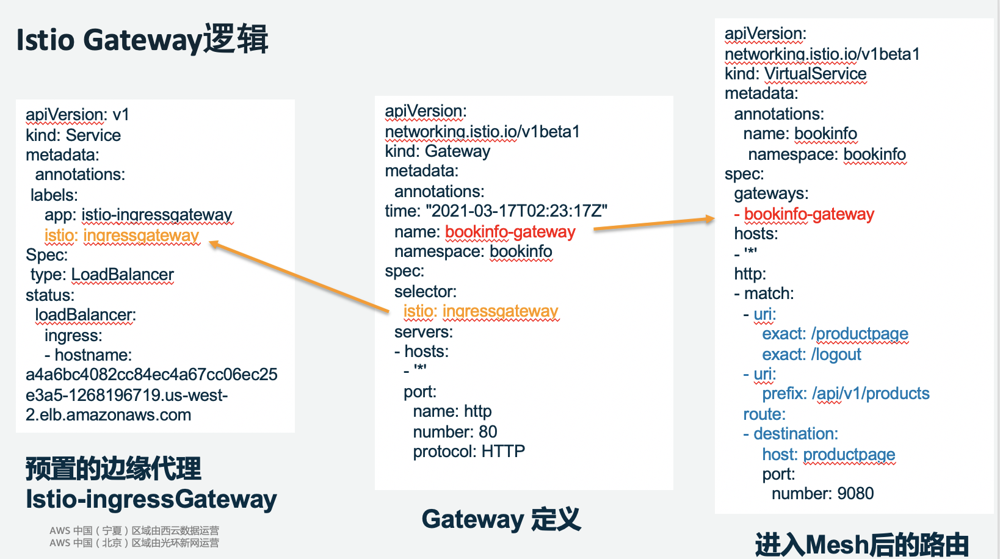
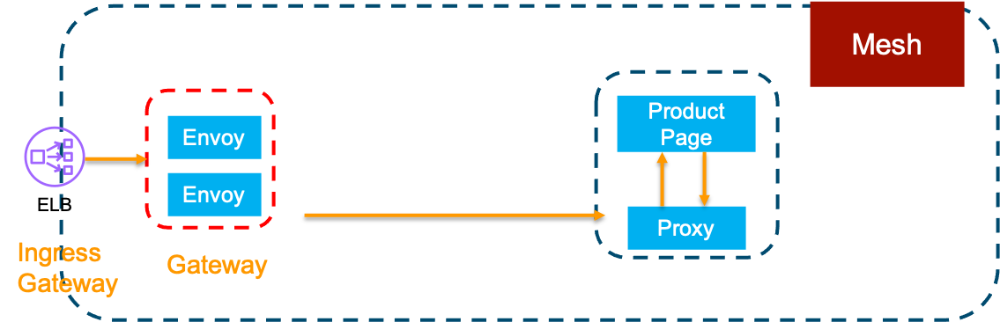

# 用AWS NLB和ALB替换Istio ingressgateway默认CLB

### 介绍

由于Istio官方关于如何配置ELB与Istio的文章已经较老，无法进行使用，故本文的目的在于演示如何使用AWS NLB或ALB来替换Istio默认生成的上一代AWS负载均衡器CLB，

### 前提条件

* 本教程依赖环境为**EKS1.19**, **ISTIO 1.10.0**

* 创建好AWS loadbalancer controller（https://kubernetes-sigs.github.io/aws-load-balancer-controller/v2.2/deploy/installation/）

* 基于https://www.eksworkshop.com/advanced/310_servicemesh_with_istio/ 完成到deploy sample apps步骤

  > 上述教程会实现istio的安装，实例应用程序的安装等，如果已有istio可按照自身情况进行更改


### 原理介绍

默认情况下Istio安装时，会安装Istio-ingressgateway，本质上为一个Service+deployment，其中Service类型为AWS CLB，Deployment为纯的envoy agent，其结合对应的virtual service进行对应**Mesh内**的流量分发，具体的逻辑关系图可以参考下图1和图2.



<center>图1:逻辑映射</center>



<center>图2:架构图</center>


### 使用AWS NLB进行替换默认Istio-ingressGateway

##### 查看修改前的情况

```
[ec2-user@ip-10-1-1-239 environment]$ kubectl -n istio-system get svc

NAME                   TYPE           CLUSTER-IP       EXTERNAL-IP           PortT(s)                                                    PORT(S)                                                                      
istio-ingressgateway   LoadBalancer   10.100.245.149   xx.lb                                
```

查看访问地址

```
export GATEWAY_URL=$(kubectl -n istio-system get service istio-ingressgateway -o jsonpath='{.status.loadBalancer.ingress[0].hostname}')

echo "http://${GATEWAY_URL}/productpage" 
```

访问得到的url看是否能通，同时可以在aws console中查看其是何种类型的负载均衡器，应为CLB

##### 添加新的ingress gateway 为nlb

```
cat <<EOF > nlb_gateway_manifest.yaml
apiVersion: install.istio.io/v1alpha1
kind: IstioOperator
spec:
  profile: demo
  components:
    base:
      enabled: true
    ingressGateways:
      - name: istio-nlb-ingressgateway
        enabled: true
        label:
          app: istio-nlb-ingressgateway
        k8s:
          serviceAnnotations:
             service.beta.kubernetes.io/aws-load-balancer-scheme: "internet-facing" 
             service.beta.kubernetes.io/aws-load-balancer-nlb-target-type: "ip"
          service:
            type: LoadBalancer
            ports:
              - name: http2
                port: 80
                targetPort: 8080
              - name: status-port
                port: 15021
                protocol: TCP
              - name: https
                port: 443
                protocol: TCP
                targetPort: 8443
              - name: tcp
                port: 31400
                protocol: TCP
                targetPort: 31400
              - name: tls
                port: 15443
                protocol: TCP
                targetPort: 15443

EOF
```

其中serviceAnnotations的下述内容解释为

*  "internet-facing: 该NLB面向公网
*  "ip" : 该NLB以IP的方式连接到后端容器

执行添加，该操作**不会删除**原有的默认gateway,**会覆盖**其他自定义的gateway

```
istioctl manifest apply -f nlb_gateway_manifest.yaml
```

查看新生成的资源

```
[ec2-user@ip-10-1-1-239 environment]$ kubectl get svc -nistio-system
NAME                       TYPE           CLUSTER-IP       EXTERNAL-IP          PORT(S)                                                                   
istio-ingressgateway       LoadBalancer   10.100.245.149   xx.lb       
istio-nlb-ingressgateway   LoadBalancer   10.100.36.163    xx.lb
```

##### 创建新的gateway(也可以修改原gateway，参见nlb部分)

```
vim ~/environment/istio-${ISTIO_VERSION}/samples/bookinfo/networking/bookinfo-gateway-nlb.yaml
```

修改如下

```
apiVersion: networking.istio.io/v1alpha3
kind: Gateway
metadata:
  name: bookinfo-gateway-nlb
spec:
  selector:
    istio: istio-nlb-ingressgateway  # use istio default controller
  servers:
  - port:
      number: 80
      name: http
      protocol: HTTP
    hosts:
    - "*"
---
apiVersion: networking.istio.io/v1alpha3
kind: VirtualService
metadata:
  name: bookinfo
spec:
  hosts:
  - "*"
  gateways:
  - istio-nlb-ingressgateway 
  http:
  - match:
    - uri:
        exact: /productpage
    - uri:
        prefix: /static
    - uri:
        exact: /login
    - uri:
        exact: /logout
    - uri:
        prefix: /api/v1/products
    route:
    - destination:
        host: productpage
        port:
          number: 9080
```

执行修改

```
kubectl apply -f bookinfo-gateway-nlb.yaml
```

访问查看

```
export GATEWAY_URL=$(kubectl -n istio-system get service istio-nlb-ingressgateway -o jsonpath='{.status.loadBalancer.ingress[0].hostname}')
echo "http://${GATEWAY_URL}/productpage"
```

同时也可以查看console中是否变更为了NLB，其目标组的类型为ip


### 使用AWS ALB进行替换默认Istio-ingressGateway

##### 添加新的ingress gateway，注意修改服务类型为NodePort

```
cat <<EOF > alb_gateway_manifest.yaml
apiVersion: install.istio.io/v1alpha1
kind: IstioOperator
spec:
  profile: demo
  components:
    base:
      enabled: true
    ingressGateways:
      - name: istio-alb-ingressgateway
        enabled: true
        label:
          app: istio-alb-ingressgateway
        k8s:
          service:
            type: NodePort
            ports:
              - name: http2
                port: 80
                targetPort: 8080
              - name: status-port
                port: 15021
                protocol: TCP
                targetPort: 15021
              - name: https
                port: 443
                protocol: TCP
                targetPort: 8443
              - name: tcp
                port: 31400
                protocol: TCP
                targetPort: 31400
              - name: tls
                port: 15443
                protocol: TCP
                targetPort: 15443
EOF
```

执行添加，该操作**不会删除**原有的默认gateway,**会覆盖**其他自定义的gateway

> 如果想同时保持多个gateway的话，可以把多个file合并然后再apply

```
istioctl manifest apply -f alb_gateway_manifest.yaml
```

##### 添加对应ingress服务

```
cat <<EOF > ingress.yaml
apiVersion: extensions/v1beta1
kind: Ingress
metadata:
  namespace: istio-system
  name: ingress
  labels:
    app: ingress
  annotations:
    kubernetes.io/ingress.class: alb
    alb.ingress.kubernetes.io/scheme: internet-facing
    alb.ingress.kubernetes.io/target-type: ip
    alb.ingress.kubernetes.io/healthcheck-port: '15021'    ## 注意端口一定要加引号
    alb.ingress.kubernetes.io/healthcheck-path: /healthz/ready
spec:
  rules:
    - http:
        paths:
          - path: /*
            backend:
              serviceName: istio-alb-ingressgateway
              servicePort: 80
EOF
```

其中需要注意的是，健康检查要设置为istio的健康检查端口和相关路径，其默认为**1502**1，以及**/healthz/ready**

##### 执行修改

```
kubectl apply -f ingress.yaml
```

##### 修改bookinfo gateway的指向为新创建的gateway(也可以创建新的gateway，参见nlb部分)

```
vim ~/environment/istio-${ISTIO_VERSION}/samples/bookinfo/networking/bookinfo-gateway.yaml
```

修改如下

```
apiVersion: networking.istio.io/v1alpha3
kind: Gateway
metadata:
  name: bookinfo-gateway
spec:
  selector:
    app: istio-alb-ingressgateway   # use istio default controller
  servers:
  - port:
      number: 80
      name: http
      protocol: HTTP
    hosts:
    - "*"

```

执行修改

```
$ kubectl apply -f bookinfo-gateway.yaml
```

访问查看

```
$ kubectl get ing -nistio-system
NAME      CLASS    HOSTS   ADDRESS                                                                 PORTS   AGE
ingress   <none>   *       k8s-istiosys-ingress-***.us-west-2.elb.amazonaws.com   80      4m40s
```

同时也可以查看console中是否变更为了ALB，其目标组的类型为ip


### 参考资料

https://stackoverflow.com/questions/62407364/how-to-set-aws-alb-instead-of-elb-in-istio

https://www.eksworkshop.com/advanced/310_servicemesh_with_istio/install/

https://istio.io/latest/blog/2018/aws-nlb/