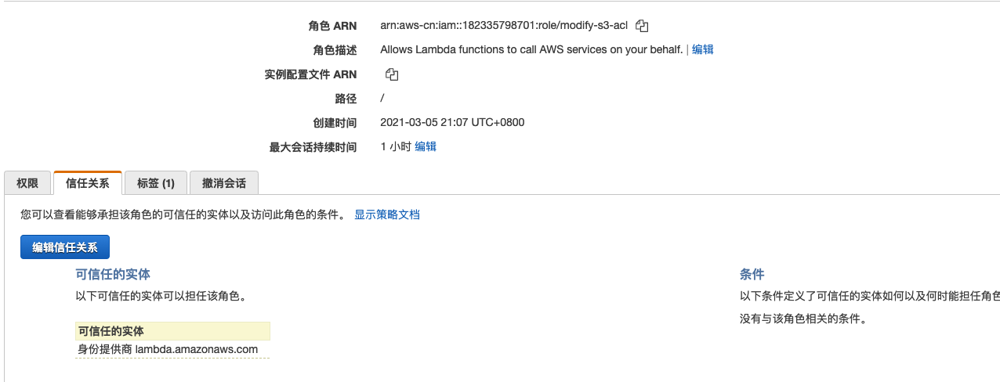
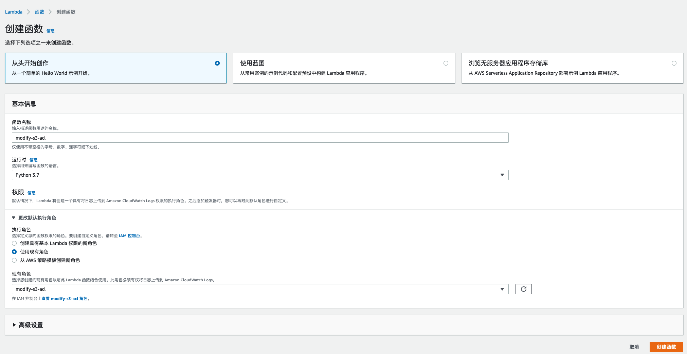
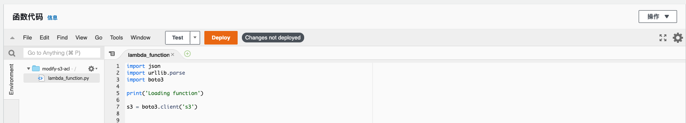
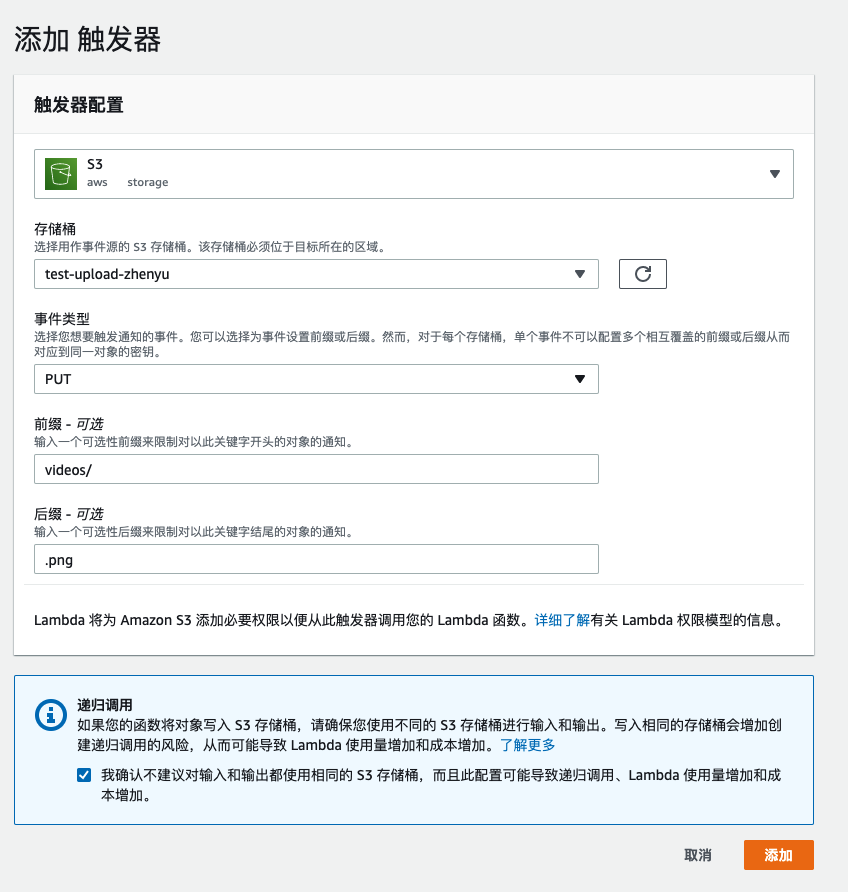
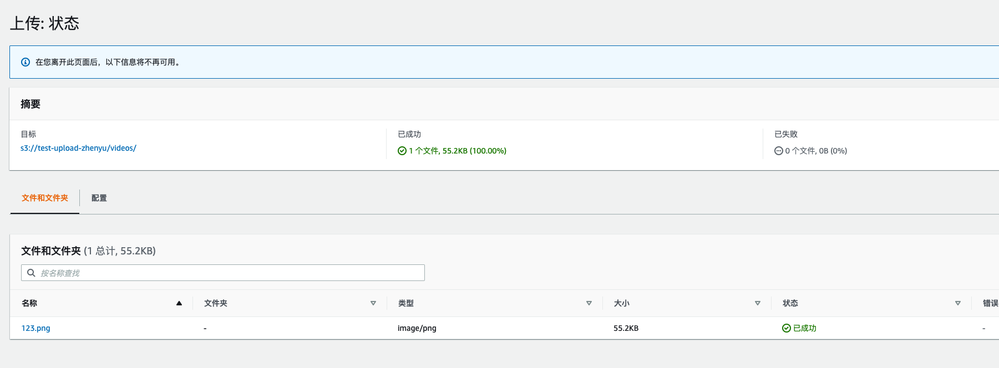
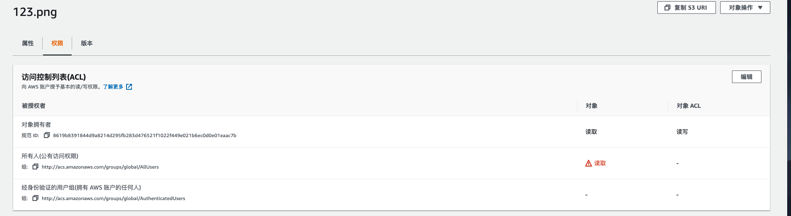

# 动态修改s3 object ACL

### 需求描述:

由于等保的要求，业务部门没有直接操作aws console的权限，但是可以通过类似cyberduck类客户端上传视频；目前客户希望对应存储视频的**bucket**不完全对外公开，而是对应上传的视频**object**进行公开可读。

### 方案设计

基于客户的需求，应该对于bucket级别只给予对应IAM user上传的权限，给予对应上传视频object公网可读的权限；因为业务方上传视频比较频繁，不可能让IT方频繁的帮其更改对应的object的acl，故采用基于s3 PUT事件（视频上传）触发lambda，通过lambda更改对应object acl的方案。

### 方案实现

1. 创建对应lambda所使用的IAM role

   需要给对应lambda函数执行修改acl的操作，以及写cloudwatch从而进行排错的权限；具体为首先编写如下的IAM policy，其中 **bucket-name** 替换为视频需要上传的s3 bucket名字

   ```
   {
       "Version": "2012-10-17",
       "Statement": [
           {
               "Sid": "VisualEditor0",
               "Effect": "Allow",
               "Action": "s3:PutObjectAcl",
               "Resource": "arn:aws-cn:s3:::bucket-name/*"
           }
       ]
   }
   ```

   创建对应的IAM 角色，附加上述IAM policy 以及**CloudWatchLogsFullAccess** 权限如下图所示

   

   角色的信任关系为Lambda，如下图所示

   

2. 创建Lambda函数

   如下图所示，创建一个新的lambda函数，执行角色选择上一步创建的modify-s3-acl

   

   创建完毕后，用如下的代码覆盖函数代码部分的lambda_function.py

   ```
   import json
   import urllib.parse
   import boto3
   
   s3 = boto3.client('s3')
   
   def lambda_handler(event, context):
       # Get the object from the event and show its content type
       bucket = event['Records'][0]['s3']['bucket']['name']
       key = urllib.parse.unquote_plus(event['Records'][0]['s3']['object']['key'], encoding='utf-8')
       try:
           response = s3.put_object_acl(
               ACL='public-read',
               Bucket=bucket,
               Key=key
           )
           print(response)
           return response
       except Exception as e:
           print(e)
           print('Error getting object {} from bucket {}. Make sure they exist and your bucket is in the same region as this function.'.format(key, bucket))
           raise e
   ```

   填写完毕后，点击如图的deploy（部署）按钮

   

3. 编写触发器

   点击代码上方Designer部分的**添加触发器**，编写lambda的触发条件为如下图所示

   

   参数说明：

   * 存储痛：需要存放视频的s3 bucket，需要和lambda在同一可用区
   * 事件类型：选择put，即视频上传完的动作
   * 前缀：对应于bucket中存储视频的folder，比如videos
   * 后缀：此处可根据视频或者图片的后缀进行设置，比如.png，.mp4等，如果有多种种类，此处可不进行填写。

   填写完毕后点击添加。

4. 实验验证

   上传测试图片，如下图所示

   

   查看对应object的acl，发现其已经被赋予了**公开读**的权限如下图所示，同时可以通过**object url直接访问**

   


