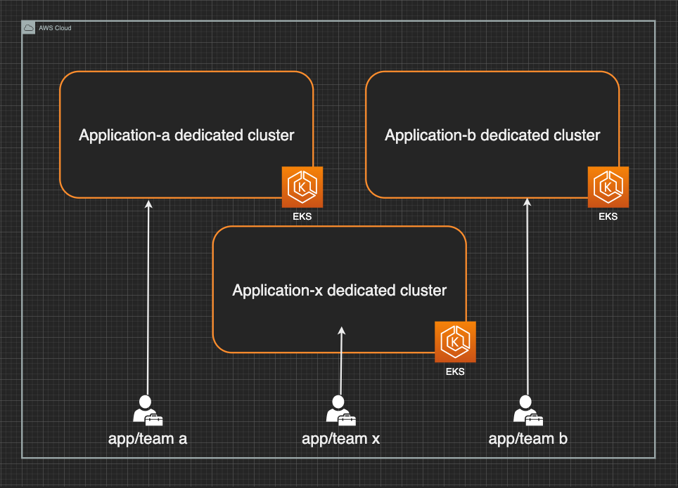
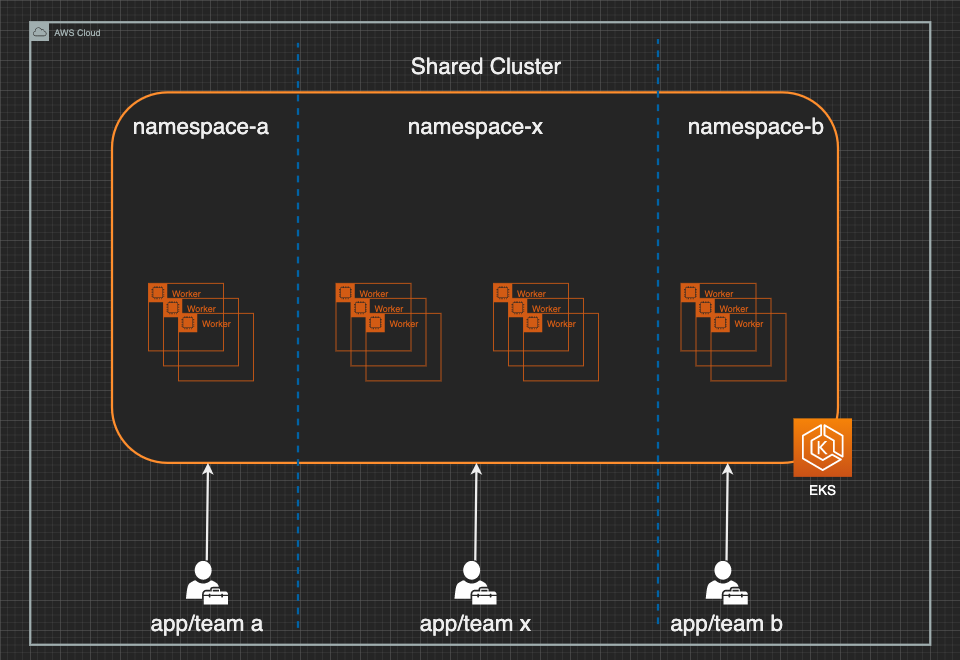
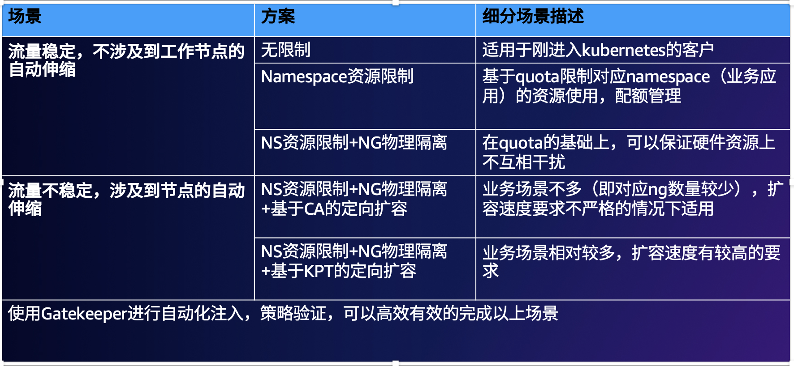

## 窝塌之下可容他人酣睡 一 EKS多租户管理浅谈 - 网络和存储篇

### 1.前言

现如今，随着用户对于容器化掌握的越来越成熟，越来越多的应用被进行了基于容器的现代化构建，其中Amazon EKS又是其中的首选平台。这个时候，经常会有一个问题摆在用户的面前：是应该对于不同的业务应用提供不同的集群，还是基于kubernetes原生的namespaces进行划分？

如果选择不同的集群对应不同的应用(如下图所示)，这种独占（dedicated）的模式可以有效避免吵闹的邻居问题，另外从运维角度来说可以相对简化集群内运维和策略的复杂度。但是同时其也带来了很多挑战，比如如何确定切分应用的粒度，如何对多集群进行运维管理，如何更高的提高每个集群的利用率，如何处理跨集群应用调用以及相应的链路追踪等等。



如果基于单集群多namespace的角度来看（如下图），首先感谢Amazon EKS[最近的升级](https://aws.amazon.com/cn/blogs/containers/amazon-eks-control-plane-auto-scaling-enhancements-improve-speed-by-4x/)， EKS控制平面现在有了基于集群指标，如Cluster Size，等的自动扩容机制，目前EKS单集群可以支持多达数千个以上的工作节点。基于此，单一集群便可支撑客户较大规模的应用部署，同时在运维角度，单一集群的管理也相对更为简单。但是，由于多应用存在于同一集群，namespace级别的隔离又是软限制，我们需要实施很多集群内的租户隔离措施，如基于namespace的网络策略，基于节点的资源隔离措施，还需要考虑集群升级等变动发生时对于不同应用部门协调所需要的额外工作量等等。



在Amazon EKS上，控制平面由AWS进行托管，基于职责分离的原则，用户更需要关注的为工作节点和相关网络的管理。因为独占模式相对简单，网络隔离会在后续的文章专门探讨，本文主要探讨的话题集中在如何在**单集群多namespace的情况下实现集群工作节点的合理且安全的利用**

### 2. 方案概述

#### 2.1 场景1：流量稳定，不涉及到工作节点的自动伸缩

对于企业内部应用或者流量较为平稳的应用来说，基于隔离的程度不同，通常情况下我们采用的策略为两种

1. namespace级别的资源限制
2. 指定工作节点+namespace级别的资源限制

##### 方案1

可以根据各个应用部门申请的资源额度，设置对应namespace的资源限额（Quota）。然后统计出集群中整体对于资源的申请情况，从而确定集群工作节点所需要的数量。配置如下：

```
apiVersion: v1
kind: ResourceQuota
metadata:
  name: mem-cpu-quota
spec:
  hard:
    requests.cpu: "1"
    requests.memory: 1Gi
    limits.cpu: "2"
    limits.memory: 2Gi
```

如果需要把对应的Quota应用到指定的Namespace只需要，`kubectl xx.yaml --namespace = target-namespace`即可。其中在示例中，大家可以看到limit的值是request的值的两倍，这样设置是为了让集群内的资源利用更高，客户可以根据自身的波动情况进行对应改造。

##### 方案2

相对于方案1来说，我们需要为不同的业务应用做资源隔离，也就是创建不同的nodegroup。这时候计算集群内对于计算资源的需求时，使得不同namespace的Quota和对应nodegroup的资源匹配即可。 比如，application-a 需要 8core16g的资源，application-b 需要 8core32g的资源那么对应的ResourceQuota 可以分别配置成如下。

```
# for application a
kubectl create ns namespace-a
cat <<EOF | kubectl apply -n namespace-a -f -
apiVersion: v1
kind: ResourceQuota
metadata:
  name: mem-cpu-quota
spec:
  hard:
    requests.cpu: "8"
    requests.memory: 16Gi
    limits.cpu: "8"
    limits.memory: 16Gi
EOF

# for application b
kubectl create ns namespace-b
cat <<EOF | kubectl apply -n namespace-b -f -
apiVersion: v1
kind: ResourceQuota
metadata:
  name: mem-cpu-quota
spec:
  hard:
    requests.cpu: "8"
    requests.memory: 32Gi
    limits.cpu: "8"
    limits.memory: 32Gi
EOF
```

配置完quota后，在应用和nodegroup级别分别打上对应的亲和性标签。其中， nodegroup上需要的亲和性配置

```
apiVersion: eksctl.io/v1alpha5
kind: ClusterConfig

metadata:
  name: managed-cluster
  region: us-west-2

managedNodeGroups:
  - name: application-a-ng
    type: m5.2xlarge
    tags:
    	app/team: application-b

```

对于应用A的deployment需要添加的亲和性配置

```
  namespace: namespace-b
  nodeSelector:
    app/team: application-b
```

对于应用a来说，配置类似，在此就不展开赘述了。如果希望更近一步在node侧做进一步限制的话，可以额外添加如下配置：

````在
# 在node上的配置
$ kubectl taint nodes node1 app/team=application-a:NoSchedule

# 需要添加在pod上的配置
apiVersion: v1
kind: Pod
```
spec:
  containers:
	```
  tolerations:
  - key: "app/team"
    operator: "Equal"
    value: "application-a"
    effect: "NoSchedule"
````

在eksctl中也有通过脚本统一为nodegroup中节点打标签的配置，可[参考](https://eksctl.io/usage/nodegroup-taints/)。 

#### 2.2 场景2:  流量不稳定，涉及到节点的自动伸缩

在场景2中，由于流量的不稳定，导致集群中工作负载（Pod）和底层的工作节点（EC2）会出现波动，那么如何使得业务容器的扩缩容和其底层工作节点得到匹配便是最主要的挑战。场景2本质上是场景1方案2的一个扩展，我们不仅需要为不同的应用配置不同nodegroup，还需节点扩展工具能够支持基于namespace/业务应用进行扩容。虽然在kubernetes中并没有一个工具直接支持namespace级别的扩容，但是基于目前主流工具对于亲和性的支持，我们可以实现类似的功能。具体来讲

* 基于**Cluster AutoScaler**实现租户资源的定向扩展

  * 创建多个nodegroup，每个nodegroup具有指定的标签

    * 比如如下两个nodegroup，分别对应**app/team: application-x的标签**

      ```
      apiVersion: eksctl.io/v1alpha5
      kind: ClusterConfig
      
      metadata:
        name: managed-cluster
        region: us-west-2
      
      managedNodeGroups:
        - name: application-a-ng
          labels: {app/team: application-a}
        - name: application-b-ng
          labels: {app/team: application-b}
      ```

  * 对于应用来说，创建对应业务应用的deployment文件，设定node selector到上述对应的节点上,

    ~~~yaml
    apiVersion: apps/v1
    kind: Deployment
    metadata:
      name: nginx-deployment
    spec
    ```
      nodeSelector:
            app/team: application-a
    ~~~

  * 当对应的应用扩容，但是底层没有节点的时候，CA会依据策略调用nodegroup进行扩容

    * CA **遵循** nodeSelector 和 requiredDuringSchedulingIgnoredDuringExecution，**不遵循**软限制如：preferredDuringSchedulingIgnoredDuringExecution, [参考](https://github.com/kubernetes/autoscaler/blob/master/cluster-autoscaler/FAQ.md#what-are-expanders)

* 基于**Karpenter**实现租户资源的定向扩展

  * 因为Karpenter为groupless模式，所以其不需要预先配置nodegroup

  * Karpenter支持两种模式的定向扩展

    * 多provisioner模式

      * 其本质跟基于CA的定向扩展原理相同，不同的provisioner对应不同的资源池，应用通过亲和性标签从而触发对应资源池的扩展。

    * 单provisioner模式 (https://karpenter.sh/v0.16.3/tasks/scheduling/)

      * 只需要在provioner配置类似如下的标签

        ```
        ...
          requirements:
          - key: company.com/team
            operator: Exists
        ...
        ```

        那么当应用中，包含如下亲和性标签的时候，那么对应启动的EC2节点都会被打上 team-a相关的标签，后续对应的应用也只会落在存在team-a相关标签的EC2-资源池中

        ```
          nodeSelector:
            company.com/team: team-a
        ```

        > 如果应用不添加对应标签，那么会给该类应用对应的工作节点随机打一标签

### 3. 实验

实验内容，本环节会分别基于CA以及Karpenter进行如下实验

* 创建namespace-a,namespace-b，namespace-c
* 基于yaml文件生成带有app/team=application-b，app/team=application-a的工作节点
* 部署nginx应用，并且指定部署在namespace-c，namespace-a，namespace-b以及对应namespace所匹配的工作节点，观察是否能够部署成功，以及相应启动速度

#### 3.1基于CA的定向扩展

##### 前提条件

* 安装eksctl，kubectl

* 配置好对应的IAM权限

* 基于官方文档进行CA在EKS上的安装，[参考](https://docs.aws.amazon.com/eks/latest/userguide/autoscaling.html)

  > 配置除了集群名称，都保持默认即可

* 创建三个namespace

  执行如下语句，创建三个租户a，b，c所使用的namespace

  ```
  kubectl create ns namespace-b
  kubectl create ns namespace-a 
  kubectl create ns namespace-c
  ```

* 下载Github repo

  ```
  git clone jansony1/container-lab
  ```

通过下面的指令，修改模版中${Cluster-name}为当前集群名称，然后添加namespace-a和namespace-b所对应的工作节点组

```
$ eksctl create ng -f multi-tenant/yaml/cluster/cluster.yaml 
[ec2-user@ip-10-1-1-239 ~]$ kubectl get nodes --show-labels
NAME                                       STATUS   ROLES    AGE   VERSION               LABELS
ip-10-1-4-230.us-west-2.compute.internal   Ready    <none>   46m   v1.23.9-eks-ba74326   alpha.eksctl.io/cluster-name=test-eks,alpha.eksctl.io/nodegroup-name=application-b-ng,app/team=application-b
ip-10-1-4-89.us-west-2.compute.internal    Ready    <none>   46m   v1.23.9-eks-ba74326   alpha.eksctl.io/cluster-name=test-eks,alpha.eksctl.io/nodegroup-name=application-a-ng,app/team=application-a
```

> 本步骤中如果不采用现有模版，也可自行通过kubectl label相关的指令给每个节点打上对应的标签，

##### 实验部分

首先查看示例代码

```
[ec2-user@ip-10-1-1-239 blog]$ cat multi-tenant/yaml/nginx/nginx-dp.yaml 
apiVersion: apps/v1
kind: Deployment
metadata:
  name: nginx-deployment
  labels:
    app/team: application-c
  namespace: namespace-c
spec:
  replicas: 
  selector:
    matchLabels:
      app: nginx
  template:
    metadata:
      labels:
        app: nginx
    spec:
      affinity:
       nodeAffinity:
        requiredDuringSchedulingIgnoredDuringExecution:
          nodeSelectorTerms:
          - matchExpressions:
            - key: app/team
              operator: In
              values:
              - application-c      
      containers:
      - name: nginx
        image: nginx:1.14.2
        ports:
        - containerPort: 80
```

其中上图中的requiredDuringSchedulingIgnoredDuringExecution，强制性指定需要匹配带有label含有app/team=application-c的节点。通过观察，我们发现pod一直处于pending状态，进而查看pod状态

```
[ec2-user@ip-10-1-1-239 blog]$ kubectl describe pods nginx-deployment-5b8c88f7dc-2s9tn -nnamespace-c

Name:           nginx-deployment-5b8c88f7dc-2s9tn
Namespace:      namespace-c
  Warning  FailedScheduling   51s   default-scheduler   0/4 nodes are available: 4 node(s) didn't match Pod's node affinity/selector.

```

可以看到，因为集群中并没有application-c label的节点，故一直无法启动。那么接下来我们实验把上面nginx-dp的匹配选项改为app/team=application-b，namespace也改为application-b，并且把节点数量扩展到5个，如下图所示

```
apiVersion: apps/v1
kind: Deployment
metadata:
  name: nginx-deployment
  labels:
    app/team: application-b
namespace: application-b
spec:
  replicas: 10
  ···
    spec:
      ···
              - key: app/team
                operator: Exist
                values:
                - application-b
```

> 需要注意的是，默认情况下基于nodegroup自动发现的逻辑，CA只会调整ASG中desired的机器数量 ，会遵循nodegroup配置的min和max；所以如果我们没有在创建nodegroup显示配置的话，那这这一步pod的启动会被卡住。 

查看对应的pod状况

```
[ec2-user@ip-10-1-1-239 blog]$ kubectl get pods -nnamespace-b -w
NAME                                READY   STATUS    RESTARTS   AGE
nginx-deployment-5dc75cb7c4-2m9ph   1/1     Running   0          27s
nginx-deployment-5dc75cb7c4-8nx2g   1/1     Running   0          26s
nginx-deployment-5dc75cb7c4-9tb4d   1/1     Running   0          117s
nginx-deployment-5dc75cb7c4-jrs8b   1/1     Running   0          119s
nginx-deployment-5dc75cb7c4-x4mv2   1/1     Running   0          120s
```

排除两个已有的节点，可以看到大概花费了120秒的时间，能够实现额外三个节点加入集群，以及基础的nginx应用的部署。另外通过查看CA的日志，可以发现CA遵循了对应的亲和性，可以达到定向扩展的需求

```
$ kubectl log -nkube-system cluster-autoscaler-787b49979f-zfllk -f

I1003 14:25:59.757031       1 filter_out_schedulable.go:157] Pod namespace-b.nginx-deployment-7b599f7555-f9wf2 marked as unschedulable can be scheduled on node ip-10-1-4-97.us-west-2.compute.internal. Ignoring in scale up.
I1003 14:25:59.757076       1 filter_out_schedulable.go:157] Pod namespace-b.nginx-deployment-7b599f7555-ndvgq marked as unschedulable can be scheduled on node template-node-for-eks-application-b-ng-fac1cc71-cf13-3164-1368-9f9140e422e8-7129107115182662064-upcoming-1. Ignoring in scale up.
I1003 14:25:59.757103       1 filter_out_schedulable.go:157] Pod namespace-b.nginx-deployment-7b599f7555-jbsqh marked as unschedulable can be scheduled on node ip-10-1-4-53.us-west-2.compute.internal. Ignoring in scale up.
I1003 14:25:59.757125       1 filter_out_schedulable.go:171] 3 pods marked as unschedulable can be scheduled.
I1003 14:25:59.757135       1 filter_out_schedulable.go:79] Schedulable pods present
I1003 14:26:09.774263       1 static_autoscaler.go:230] Starting main loop
I1003 14:26:09.774713       1 clusterstate.go:248] Scale up in group eks-application-b-ng-fac1cc71-cf13-3164-1368-9f9140e422e8 finished successfully in 1m30.437631771s
```

##### 清理

为了避免CA和karpenter互相干扰，在下一实验开始前，**请卸载CA**，以及通过如下指令清除deployment

```
kubectl delete deployment nginx-deployment -nnamespace-b
```

#### 3.2 基于Karpenter的定向扩展

##### 前提条件

* 部署Kapenter在集群中,[参考](https://karpenter.sh/v0.16.3/getting-started/getting-started-with-eksctl/)

##### 实验部分

制作provisioner，本环节将会分别生成application-a-provisioner和application-b-provisioner，分别负责应用a和应用b的计算资源需求。执行下述操作生成provisioner，注意在执行前把**${CLUSTER_NAME}**换成自己的

```
$ kubectl apply -f multi-tenant/yaml/provisioner/
```

我们可以看到对应的两个provisioner已经生成

```
[ec2-user@ip-10-1-1-239 blog]$ kubectl get provisioners
NAME                        AGE
application-a-provisioner   38s
application-b-provisioner   17s
```

两个provisioner的主要区别，主要为下面的taint对应的应用部门不同，即工作节点不同

```
kind: Provisioner
metadata:
  name: application-x-provisioner
spec:
  requirements:
   - key: node.kubernetes.io/instance-type
     operator: In
     values: ["m5.large", "m5.2xlarge"]
  taints:
    - key: app/team
      value: application-x
      effect: NoSchedule
  labels：
    app/team: application-a
```

该provisioner生成的节点都具有**app/team=application-x** label和 污点，应用如果想落在对应的机器，需要有对应的toleration和nodeselector才可。继续查看nginx的代码，我们可以看到其对应的toleration和资源的配置。

```
$ cat nginx-dp-kpt.yaml
apiVersion: apps/v1
kind: Deployment
metadata:
  name: nginx-deployment-kpt
  labels:
    app/team: application-a
  namespace: namespace-a
spec:
  replicas: 5
   ...
    spec:
      nodeSelector:
        app/team: application-a
      tolerations:
        - key: app/team
          operator: "Equal"
          value: "application-a"
          effect: "NoSchedule"
      containers:
        ...
        resources:
          requests:
            memory: "2048Mi"
            cpu: "1500m"
          limits:
            memory: "2048Mi"
            cpu: "1500m"
```

执行部署

```
$ kubectl apply -f multi-tenant/yaml/nginx/nginx-dp-kpt.yaml
```

观察执行结果

```
[ec2-user@ip-10-1-1-239 blog]$ kubectl get pods 
NAME                                READY   STATUS    RESTARTS   AGE
nginx-deployment-kpt-585c679d5d-5kc8r   1/1     Running   0          96s
nginx-deployment-kpt-585c679d5d-j9g6t   1/1     Running   0          96s
nginx-deployment-kpt-585c679d5d-jgkvh   1/1     Running   0          96s
nginx-deployment-kpt-585c679d5d-lhx6s   1/1     Running   0          96s
nginx-deployment-kpt-585c679d5d-p54h5   1/1     Running   0          96s
```

可以看到，所有pod在100s内完成了就绪，查看karpenter的日志，我们发现其遍历了多个provisioner，并从中选择了匹配的provisioner-a，且**自动合并**了我们多个pod请求，从而在列表中选择了较大的机型进行启动，避免了多次调用AWS API，以及时间的消耗。

```
2022-10-04T07:12:17.207Z	INFO	controller.provisioning	Found 3 provisionable pod(s)	{"commit": "5d4ae35-dirty"}
2022-10-04T07:12:17.207Z	INFO	controller.provisioning	Computed 1 new node(s) will fit 3 pod(s)	{"commit": "5d4ae35-dirty"}
2022-10-04T07:12:17.207Z	INFO	controller.provisioning	Launching node with 3 pods requesting {"cpu":"4594m","memory":"6Gi","pods":"6"} from types m5.2xlarge	{"commit": "5d4ae35-dirty", "provisioner": "application-a-provisioner"}
2022-10-04T07:12:17.389Z	DEBUG	controller.provisioning.cloudprovider	Discovered security groups: [sg-049758300817976ce]	{"commit": "5d4ae35-dirty", "provisioner": "application-a-provisioner"}
2022-10-04T07:12:17.393Z	DEBUG	controller.provisioning.cloudprovider	Discovered kubernetes version 1.23	{"commit": "5d4ae35-dirty", "provisioner": "application-a-provisioner"}
2022-10-04T07:12:17.428Z	DEBUG	controller.provisioning.cloudprovider	Discovered ami-050d93f2ea83da19d for query "/aws/service/eks/optimized-ami/1.23/amazon-linux-2/recommended/image_id"	{"commit": "5d4ae35-dirty", "provisioner": "application-a-provisioner"}
2022-10-04T07:12:17.588Z	DEBUG	controller.provisioning.cloudprovider	Created launch template, Karpenter-test-eks-1-4579713353214019755	{"commit": "5d4ae35-dirty", "provisioner": "application-a-provisioner"}
2022-10-04T07:12:20.650Z	INFO	controller.provisioning.cloudprovider	Launched instance: i-035a7efc520610dc7, hostname: ip-10-1-4-148.us-west-2.compute.internal, type: m5.2xlarge, zone: us-west-2a, capacityType: on-demand	{"commit": "5d4ae35-dirty", "provisioner": "application-a-provisioner"}
```

#### 3.3 利用Gatekeeper实现namespace级别的管控和注入

我们发现，无论在3.1和3.2的实验中，我们都是**手动修改**应用的namespace归属，以及对应的亲和性设置。那么从安全性和便利的角度来说，都不是一个好的实践，这时候我们可以引入Gatekeeper，来使得部署在指定namespaces的容器必须具备特定的亲和性设置。此外，因为我们基于namespace级别设置了对应的request和limit限制，我们需要对于未设置request和limit值的容器给予禁止部署。

##### 安装Gatekeeper

```
helm repo add gatekeeper https://open-policy-agent.github.io/gatekeeper/charts
helm install gatekeeper/gatekeeper --name-template=gatekeeper --namespace gatekeeper-system --create-namespace
```

> 注意使用前记得更新helm的版本，否则会出现兼容性bug

查看状态

```
[ec2-user@ip-10-1-1-239 blog]$ kubectl get pods --all-namespaces
NAMESPACE           NAME                                            READY   STATUS    RESTARTS   AGE
gatekeeper-system   gatekeeper-audit-66c58476d7-swq9q               1/1     Running   0          29m
gatekeeper-system   gatekeeper-controller-manager-dcb9c7fff-nxmn6   1/1     Running   0          29m
```

##### 设定必须填写request值，才能够部署

安装插件

```
$ kubectl apply -f https://raw.githubusercontent.com/open-policy-agent/gatekeeper-library/master/library/general/containerrequests/template.yaml
```

部署策略

```
cat <<EOF | kubectl apply -f -
apiVersion: constraints.gatekeeper.sh/v1beta1
kind: K8sContainerRequests
metadata:
  name: container-must-have-request
spec:
  match:
    kinds:
      - apiGroups: [""]
        kinds: ["Pod"]
  parameters:
    cpu: "2000m"
    memory: "2Gi"
EOF
```

其中限制了部署应用必须显示指定request值以及相应的最大值，否则部署出错。 接下来部署测试应用

```
$ kubectl apply -f multi-tenant/yaml/nginx/nginx-dp-no-request.yaml
```

查看状态

```
## 观察对应的ns无返回
$ kubectl get pods -n namespace-a

## 查看日志，发现请求被deny
$ kubectl logs gatekeeper-controller-manager-dcb9c7fff-nxmn6 -ngatekeeper-system
{"level":"info","ts":1664888600.9350498,"logger":"controller","msg":"constraint added to OPA","process":"constraint_controller","event_type":"constraint_added","constraint_group":"constraints.gatekeeper.sh","constraint_api_version":"v1beta1","constraint_kind":"K8sContainerRequests","constraint_name":"container-must-have-request","constraint_action":"deny","constraint_status":"enforced"}

```

修改应用为有request值，在multi-tenant/yaml/nginx/nginx-dp-no-request.yaml 最下方加入如下字段

````
resources:
  requests:
  	memory: "2048Mi"
  	cpu: "1500m"
  limits:
  	memory: "2048Mi"
  	cpu: "1500m"
````

重新部署，发现容器启动正常

```
[ec2-user@ip-10-1-1-239 blog]$ kubectl get pods -nnamespace-a
NAME                                READY   STATUS    RESTARTS   AGE
nginx-deployment-no-request-6f7fdfd875-2f6kv   1/1     Running   0          14s
```

##### 设定pod自动注入亲和性设置

部署webhook

```
cat <<EOF | kubectl apply -f -
apiVersion: mutations.gatekeeper.sh/v1beta1
kind: Assign
metadata:
  name: namespace-a-selector
  namespace: gatekeeper-system
spec:
  applyTo:
    - groups: [""]
      kinds: ["Pod"]
      versions: ["v1"]
  match:
    scope: Namespaced
    kinds:
      - apiGroups: ["*"]
        kinds: ["Pod"]
    namespaces: ["namespace-a"]
  location: "spec.nodeSelector"
  parameters:
    assign:
      value:
        app/team: "application-a"
EOF
```

其中写明了，如果是部署在namespace-a的应用，那么会通过webhook注入如下的标签, 当然也可以注入其他选项，如toleration等。 

```
nodeSelector
	app/team: "application-a"
```

部署应用 

```
## 发现除了三个跑在已有application-a-ng上的pod启动外，其他pod因为注入了selector无法调度
[ec2-user@ip-10-1-1-239 ~]$ kubectl get pods -nnamespace-a -owide
NAME                                            READY   STATUS    RESTARTS   AGE     IP        
namespace-a         nginx-deployment-no-selector-6f7fdfd875-2n8hd   1/1     Running   0          
namespace-a         nginx-deployment-no-selector-6f7fdfd875-8fp5l   0/1     Pending   0          
namespace-a         nginx-deployment-no-selector-6f7fdfd875-8qv5g   1/1     Running   0          
namespace-a         nginx-deployment-no-selector-6f7fdfd875-b2xbm   0/1     Pending   0          
namespace-a         nginx-deployment-no-selector-6f7fdfd875-zk9hd   0/1     Pending   0 

```

查看pod， 发现selector已经注入成功

```
[ec2-user@ip-10-1-1-239 ~]$ kubectl describe pods nginx-deployment-no-selector-6f7fdfd875-2n8hd -nnamespace-a
...
Node-Selectors:              app/team=application-a
...
```

稍等片刻，发现pod已经全部ready，并且全部落在了provioner-a生成的新节点上。

```
## 前两个属于application-b-ng, 
[ec2-user@ip-10-1-1-239 ~]$ kubectl get nodes
NAME                                       STATUS   ROLES    AGE   VERSION
ip-10-1-4-197.us-west-2.compute.internal   Ready    <none>   10h   v1.23.9-eks-ba74326
ip-10-1-4-59.us-west-2.compute.internal    Ready    <none>   86s   v1.23.9-eks-ba74326
ip-10-1-4-6.us-west-2.compute.internal     Ready    <none>   10h   v1.23.9-eks-ba74326
ip-10-1-6-111.us-west-2.compute.internal   Ready    <none>   10h   v1.23.9-eks-ba74326
ip-10-1-6-58.us-west-2.compute.internal    Ready    <none>   10h   v1.23.9-eks-ba74326


[ec2-user@ip-10-1-1-239 ~]$ kubectl get pods -nnamespace-a -owide
NAME                                            READY   STATUS    RESTARTS   AGE     IP           NODE                                       NOMINATED NODE   READINESS GATES
nginx-deployment-no-selector-6f7fdfd875-2n8hd   1/1     Running   0          5m10s   10.1.4.4     ip-10-1-4-197.us-west-2.compute.internal   <none>           <none>
nginx-deployment-no-selector-6f7fdfd875-8fp5l   1/1     Running   0          5m10s   10.1.4.114   ip-10-1-4-59.us-west-2.compute.internal    <none>           <none>
nginx-deployment-no-selector-6f7fdfd875-8qv5g   1/1     Running   0          5m10s   10.1.6.51    ip-10-1-6-58.us-west-2.compute.internal    <none>           <none>
nginx-deployment-no-selector-6f7fdfd875-b2xbm   1/1     Running   0          5m10s   10.1.4.228   ip-10-1-4-59.us-west-2.compute.internal    <none>           <none>
nginx-deployment-no-selector-6f7fdfd875-zk9hd   1/1     Running   0          5m10s   10.1.4.113   ip-10-1-4-59.us-west-2.compute.internal    <none>           <none>
```

### 4. 总结

#### 通过以上的方案的展开，我们了解到了在单集群多namespace环境下实现租户之间资源的隔离的几种常见划分和对应手段，其可以为客户在制定对应策略时提供基本的参考。

##### 同时我们在与各位优秀的客户交流的过程中感受到并没有一概而论的方案去应对多租户场景下，应用到底应该是按集群级别进行隔离，还是namespace级别进行隔离。在过往的经历中，我们看到了很多进入多租户深水区的客户往往采用了上述两种方式的结合，他们通常会对SLA要求等级比较高的应用进行单集群的部署，SLA相对较低的应用进行单集群namespace级别的隔离。所以采用哪种方式不能一概而论，取决于客户当前所属的阶段，应用的大小和多少，以及相关应用SLA的等级来划分。我们通常建议客户刚起步时，可以基于单集群多namespace 的形态进行划分，然后在进行逐步的演进。

最后，附上相关的总结

### 

### 参考文档

EKS enhancement: https://aws.amazon.com/cn/blogs/containers/amazon-eks-control-plane-auto-scaling-enhancements-improve-speed-by-4x/

Cluster Autoscaler: https://github.com/kubernetes/autoscaler/blob/master/cluster-autoscaler/FAQ.md#what-are-expanders

Karpenter： https://karpenter.sh/v0.16.3/tasks/scheduling/

Gatekeeper：https://github.com/open-policy-agent/gatekeeper


